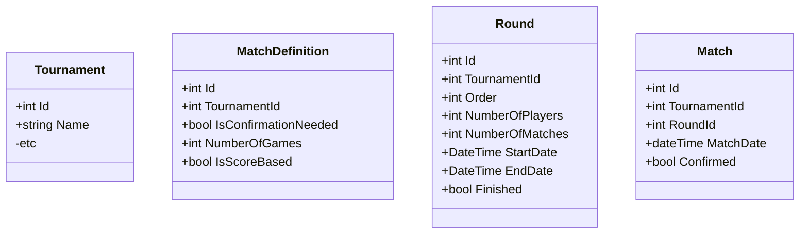

# Requirements
## TournamentService
### Create Tournament
- Select discipline
- Select platform
- Name
- Type of participant team/player
- Number of teams/players (512) then min/max number of players in team
- Timezone
### Configure tournament
- Start Date
- Registration ends Date (if null it's not used) then register time ends on checkin/start date
- Checkin Date (if null then it's not used)
- Checkin Time (in minutes / hours)
- Location of offline tournament
- Official Website
- Logo(?) 
- Description
- Prizes (text description)
- Rules (string of path file / URL - Rules as file)
- Contact data 
    - email
    - phone number
- `Custom player fields`
- `Stream urls (name, language, URL)` (hstore)
- `Region/country allowed to play in tournament`
- Tournament type/format
    - Single Elimination
    - Groups
        - `number of the same matches`
    - League
        - `number of the same matches`
- `Sponsors`
    - link
    - image/logo(?)
- Invite only
- Is acceptance needed of admin to join tournament
- Matches settings (below)
- Publish option to allow users to join
### Configure matches
- Name of settings
- Type of match (not represented in a DB)
    - Single game
    - Best-of (max number of matches)
- Is confirmation needed (referee)
- Date of match
- Settings are set per round
    - Single Elimination eg. semi-final, final
    - Group: eg. 1st match, 2nd match
    - League: eg. 1st fixture, 2nd fixture

### Classes (to refactor)

### Business Logic Layer
What needs typical crud
- Tournament
- 

Mockups
https://www.figma.com/proto/jFskEgDJAPl2dLoKPQjVOP/Playprism?node-id=12%3A1557&viewport=470%2C966%2C0.3873078227043152&scaling=min-zoom