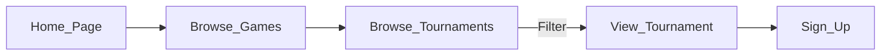
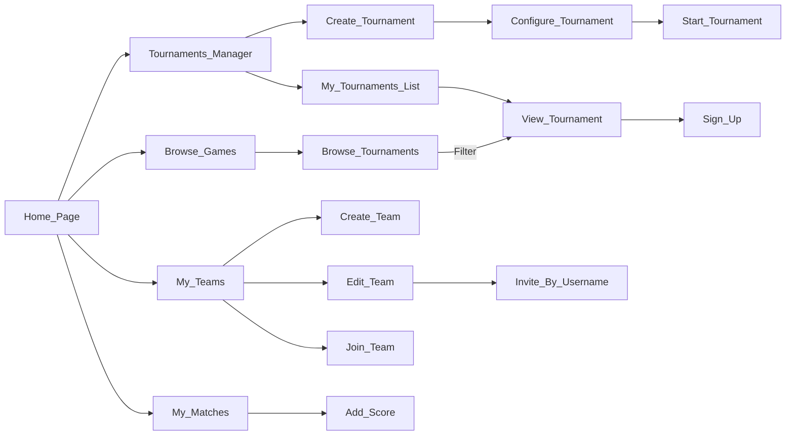

# UI Flow
`Home_Page` is `Browse_Games` for now
## Not logged in

`Sign_Up` - sign up to tournament as competitor. It redirects to login page and then back to `View_Tournament`
## Logged In

`My_Teams` list of teams I'm owner of, part of, invitations